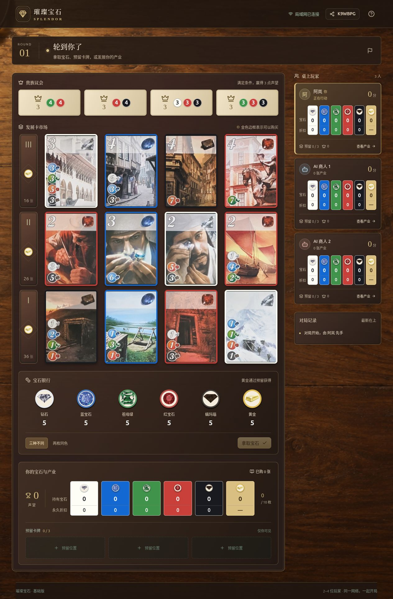

# LabGames · 局域网小游戏

和朋友连接同一网络，打开浏览器，一起开桌。

LabGames 收录三款中文网页桌游：德州扑克、璀璨宝石和七连翻。每款游戏都支持与电脑对战，也能由一台电脑运行服务，让同一 Wi-Fi 或局域网内的朋友加入。玩家端只需浏览器，无需注册或安装客户端。

## 选一款游戏

| 游戏                  | 牌桌人数（含电脑） | 玩法                                       | 安装与启动                                  |
| --------------------- | ------------------ | ------------------------------------------ | ------------------------------------------- |
| ♠ 德州扑克           | 2～6 人            | 看牌、下注、读懂对手，在摊牌中赢下底池     | [扑克 README](games/poker/README.md)        |
| ◆ 璀璨宝石 · Splendor | 2～4 人            | 收集宝石、购买产业，以永久折扣积累声望     | [璀璨宝石 README](games/splendor/README.md) |
| 7 七连翻 · Flip 7     | 3～6 人            | 继续翻牌还是及时收手，在爆牌风险中争取高分 | [七连翻 README](games/flip7/README.md)      |

人数不足时，可以添加电脑补位。三个游戏独立启动、独立保存进度，也可以同时运行。

## ♠ 德州扑克

一张使用虚拟筹码的无限注德州扑克牌桌。从翻牌前到河牌，选择过牌、跟注、加注或弃牌，与不同风格的电脑对手练习，也可以邀请朋友同桌。

- 浏览器支持 2～6 人，真人与电脑可混坐；提供八种电脑策略。
- 自动处理主池、边池和摊牌比较，支持逐手复盘与筹码曲线。
- 好友房支持邀请链接、二维码、入桌审批、暂时离席及座位找回。


[查看依赖与启动方法 →](games/poker/README.md) · [玩法与命令行进阶 →](games/poker/docs/GUIDE.md)

## ◆ 璀璨宝石 · Splendor

扮演宝石商人，从第一枚宝石开始建立自己的产业。拿取资源、预留发展卡、购买永久折扣，争取贵族青睐；有人达到 15 分后进入最终轮。

- 支持基础版 2～4 人桌，可由一位真人对战最多三位电脑。
- 90 张发展卡与 10 位贵族，自动校验支付、黄金使用和资源归还。
- 原版卡面、邀请链接与二维码，支持刷新续局和服务器重启恢复。



[查看依赖与启动方法 →](games/splendor/README.md)

## 7 七连翻 · Flip 7

翻到不同数字就继续累积分数，重复数字则爆牌。选择及时收手，或冲击七张不同数字的额外 15 分奖励，争夺 200 分终点。

- 支持单人对战电脑与 3～6 人局域网房间，每次联机行动限时 10 秒。
- 原版卡面、状态印章、洗牌动画与排行榜；七连翻庆祝等待全员鼓掌后收起。
- 全桌弹幕与可选记牌器；房主可在准备大厅调整设置，下一局无需重建房间。


[查看依赖与启动方法 →](games/flip7/README.md) · [联机功能说明 →](games/flip7/docs/MULTIPLAYER.md)

## 如何开始

选择上面的游戏，进入对应 README，按「环境依赖 → 首次安装 → 启动」操作。只需主机安装运行环境，其他玩家通过浏览器加入；首次安装依赖可能需要联网，游戏运行期间无需外部服务或 API Key。

| 游戏     | 主机环境                     | 默认端口 | 默认访问范围                |
| -------- | ---------------------------- | -------- | --------------------------- |
| 德州扑克 | Python 3.11+                 | `8765`   | 本机；加 `--lan` 开启局域网 |
| 璀璨宝石 | Node.js 22.13+、pnpm 11.19.0 | `3000`   | 局域网                      |
| 七连翻   | Node.js 22+                  | `3007`   | 局域网                      |

联机时保持主机和服务运行，并分享主机的局域网地址。其他设备上的 `localhost` 指向它们自己，不能用来连接主机。

## 项目导航

```text
LabGames/
├── README.md                 # 游戏总览与截图
├── docs/
│   ├── screenshots/          # 实际游戏界面截图
│   └── REPOSITORY_HISTORY.md  # 仓库导入与迁移记录
└── games/
    ├── poker/README.md        # 德州扑克安装、启动与维护
    ├── splendor/README.md     # 璀璨宝石安装、启动与维护
    └── flip7/README.md        # 七连翻安装、启动与维护
```

新增游戏时，在 `games/` 下建立独立目录和 README，再补充本页的游戏简介、截图与入口。截图均取自本项目的实际演示对局，采集说明见 [截图目录](docs/screenshots/README.md)。

原项目的导入提交与迁移方式见 [仓库迁移记录](docs/REPOSITORY_HISTORY.md)。

## 素材说明

本项目中的 Splendor 与 Flip 7 为非官方实现，名称及原版美术归相应权利人所有。素材来源和使用方式见 [璀璨宝石素材说明](games/splendor/docs/ART_SOURCES.md) 与 [七连翻素材说明](games/flip7/docs/ART_SOURCES.md)。
